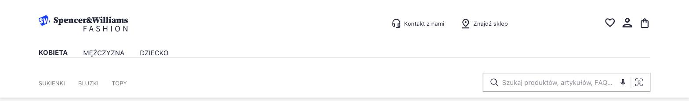
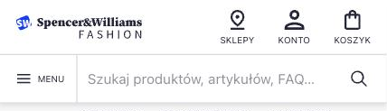
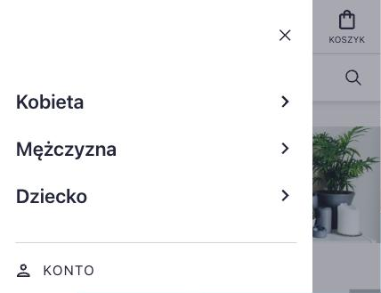

# design-presta-2

Sklep PrestaShop 8.2.7 (PHP 8.1) uruchamiany w Dockerze.

## Zakres

Nagłówek sklepu, nie cały sklep — child theme motywu `classic`. Reszta strony zostaje taka,
jaką daje PrestaShop.

Design: [Ecommerce Search & Discovery UI Kit](https://www.figma.com/community/file/981543186947734892/ecommerce-search-discovery-ui-kit)
z Figma Community. Widok desktopowy i mobilny odwzorowane 1:1. Kit rysuje tylko te dwie
szerokości — 375 i 1440 px. Układ pomiędzy nimi jest prosty i skaluje się płynnie.



<p>
  
  
</p>

## Uruchomienie

```bash
cp .env.example .env
```

Uzupełnij `DB_PASSWORD` i `DB_ROOT_PASSWORD` własnymi wartościami, potem:

```bash
docker compose up -d
```

| Usługa     | Adres                   |
|------------|-------------------------|
| Sklep      | http://localhost:1001   |
| phpMyAdmin | http://localhost:1002   |

## Instalacja

Instalator nie uruchamia się automatycznie (`PS_INSTALL_AUTO=0`). Przy pierwszym wejściu
na http://localhost:1001 sklep przekieruje na kreator. W kroku konfiguracji bazy:

| Pole              | Wartość                |
|-------------------|------------------------|
| Adres serwera     | `mysql`                |
| Nazwa bazy        | wartość `DB_NAME`      |
| Login             | wartość `DB_USER`      |
| Hasło             | wartość `DB_PASSWORD`  |
| Prefiks tabel     | `ps_`                  |

Po zakończeniu instalacji PrestaShop wymaga usunięcia katalogu instalatora:

```bash
docker exec presta2-shop rm -rf /var/www/html/install
```

Nazwę wygenerowanego katalogu panelu administracyjnego odczytasz tak:

```bash
docker exec presta2-shop sh -c 'ls -d /var/www/html/admin*'
```

## Po instalacji

Repo nie zawiera dumpu bazy, więc świeża instalacja startuje z katalogiem demo PrestaShopu
i motywem `classic`. Poniższe kroki doprowadzają sklep do stanu, dla którego ten motyw
był robiony.

### 1. Motyw

`Wygląd → Motywy i logo` → w sekcji z dostępnymi motywami użyj **Design Presta**.

### 2. Moduł Design Menu

`Moduły → Menedżer modułów` → wyszukaj **Design Menu** → *Zainstaluj*. To samo z linii poleceń:

```bash
docker exec presta2-shop php bin/console prestashop:module install designmenu
```

Instalacja zakłada trzy działy nagłówka — Kobieta, Mężczyzna, Dziecko — aktywne i puste.
Dział bez przypisanych pozycji nie filtruje menu, więc do czasu konfiguracji z punktu 4
każdy z nich pokazuje pełne drzewo kategorii.

### 3. Katalog i menu

Identyfikatory kategorii są danymi konkretnej bazy, więc tego kroku nie da się zaszyć
w kodzie modułu — trzeba go wyklikać raz:

1. `Katalog → Kategorie` — dodaj kategorie, które mają stać w nagłówku.
2. `Moduły → Menedżer modułów` → **Główne menu** → *Konfiguruj* — przenieś te kategorie
   do wybranych pozycji menu.

### 4. Przypisanie kategorii do działów

`Moduły → Menedżer modułów` → **Design Menu** → *Konfiguruj*. Przy każdym dziale zaznacz
pozycje menu, które ma pokazywać. Etykiety działów są polami per język — tam też zmienisz
ich nazwy.

### 5. Ustawienia na czas pracy nad motywem

`Parametry zaawansowane → Wydajność` — wyłącz `Buforowanie CSS`, `Buforowanie JavaScript`
i `Pamięć podręczna Smarty`. Bez tego ostatniego zmiany w szablonach nie będą widoczne
mimo poprawnego kodu. Przed wdrożeniem produkcyjnym wszystkie trzy wracają na włączone.

## Zatrzymanie

```bash
docker compose down
```

Pliki sklepu leżą w katalogu `prestashop/` na dysku i `down` ich nie rusza. Baza siedzi
w wolumenie `mysql_data` i też przeżywa `down`; kasuje ją dopiero `docker compose down -v`.

Katalog `prestashop/` jest w `.gitignore` poza `themes/`, `modules/` i `override/` —
rdzeń PrestaShopu nie trafia do repo, bo odtwarza go tag obrazu z `docker-compose.yml`.
